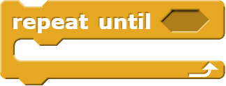
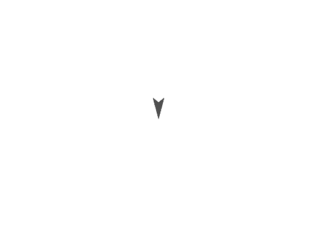

# The Repeat Until Block

<!--
Notes:
- Move forward until sprite hits edge (can't do with repeat)
- Repeat until slide
- Fix code to work w/ repeat until, randomness
- Modify: Sprite points down instead
- Predicates
- Modify task to triangle
- Show code after repeat
- Quiz
-->

---
## The Repeat Block

The `repeat until <___>` block repeats all actions inside of it, in order, **until** its condition is met.

**Example**: *This code will move the Sprite forward **until** the space key is pressed.*

---
## Predicate Blocks

Hexagon-shaped blocks that always report either **true** or **false**.

**Example**: *This code will report **true** if the user's `answer` is "Yes", and otherwise **false***

---
<!-- .slide: id="goDown" -->
## Modify: Move Downwards

**Goal**: Modify the current code so that the Sprite stops moving when it's *y-position* is less than -150:

 <!-- .element style="width: 40%" -->

[Hints](#/goDown-hint)

v---v
<!-- .slide: id="goDown-hint" -->
## Hints

* Remember, as the sprite moves downward, y *decreases*.
* There is also a `y position` block under the Motion category.
* You may need the `__ < __` (less than) predicate block.

[Back](#/goDown)

---
<!-- .slide: id="q1" -->
## Knowledge Check: Repeat
What will the following code say when it runs?

[A) One Two Three Four](#/a)

[B) One Two Three Four One Two Three Four](#/b)

[C) One Two Two Three Three Four](#/c)

[D) One Two Three Two Three Four](#/d)

v---v
<!-- .slide: id="a" -->
## A

Incorrect: Remember, the `Repeat` block causes the code inside of it to run multiple times.

[Try again?](#/q1)

v---v
<!-- .slide: id="b" -->
## B

Incorrect: Remember, the `Repeat` block only affects code inside of it.

[Try again?](#/q1)

v---v
<!-- .slide: id="c" -->
## C

Incorrect: Remember, the `Repeat` runs the code inside of it *in order*!

[Try again?](#/q1)

v---v
<!-- .slide: id="d" data-background-color="#3333aa" -->
## D

Correct! Only the code inside of the loop gets repeated.

<button class="navigate-right btn btn-success">Continue</button>

---
<!-- .slide: id="q1-finished" data-state="q-finished" -->
## Good job!