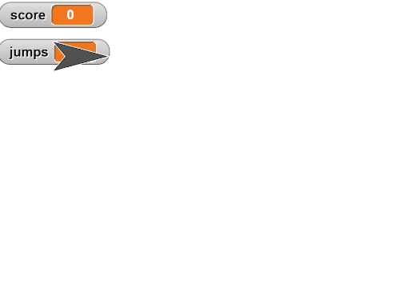

# Variables

<!--
Notes:
* Name: score
* Slide: Major blocks
* Initialize: 0 at green flag
* Update: +1 when clicked
* Use: Say score
* Slides: Recipe, Types of data
* Modify Task:
-->

---
## Variable Blocks

These are the primary blocks used with variables

*  **Sets** a variable to the given value (e.g. 0)
*  **Changes** a variable, increasing its value by the input (or decreasing if negative)
*  **Uses** the variable in another block.

---
## Using Variables

Follow this *recipe* when using a variable:

1. **Create** the variable and give it a descriptive name.
2. **Initialize** the variable to a starting value (e.g. when the play button is pressed).
3. **Change** the variable value when appropriate.
4. **Use** the variable value in your code.

---
## Types of Data

Variables can store different types of data:

* A number: `5`, `0`, `-2`, `7.3`
* Some text: `"Hello, World!"`, `"Goodbye"`
* A "boolean" value: `true` or `false`
* A list of other data: `[1, 2, 3]` or `["A", "B", "C"]`

---
<!-- .slide: id="jumps" -->
## Modify: Count Jumps

**Goal**: Create a new variable called `jumps` that counts the number of times
the sprite has jumped, starting at 0.

[Hints](#/jumps-hint)

v---v
<!-- .slide: id="jumps-hint" -->
## Hints

Follow the variable recipe:

1. Create the variable using the "Make a variable" button under the "Variables" tab.
2. Give it a starting value (0) when the green flag is clicked.
3. Increase the value (by 1) whenever the sprite jumps (the `go to` block).

[Back](#/jumps)
