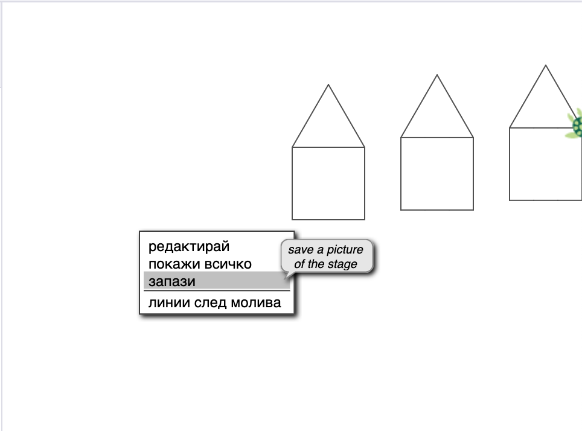
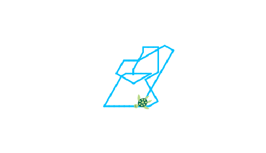

# Добре дошли

 Цветелин Андреев

---
## Цел на урока

* Да се запознаем с Костенурката.
* Да я накараме да рисува къщи, коли, хора, самолети.

---
# Основни команди

---
# Демонстрация КЪЩА

---

---
### Задача 1

# Вие сте наред. Рисувайте!

---
### Задача 2

# Нарисувайте първата буква от името си

---
# От участниците

---

Небе и трева. Вяра (5 г.)

---
## Изпратете вашите най-красиви рисунки 

* Чрез чат бутона долу вдясно или
* Чрез електронна поща на <a href='mailto:cvetelin.andreev@gmail.com' target="_blank">cvetelin.andreev@gmail.com</a>

---
# Обобщение

---
# Благодаря

---
## Бележки

Идеята за задачата е взета от учебника ‘Информатика за начинаещи – част 1 – или с костенурката напред’, Евгения Сендова, Румен Николов, Издателство “Народна просвета”, 1989 г.

