# Добре дошли

---

## С Костенурката напред 

#####  Цветелин Андреев

---
# Преговор

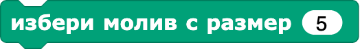

---
## Цел на урока

* Да направите първата си програма на езика на костенурката - Snap<em>!</em>
* Да споделите програмата си

---
## Къща

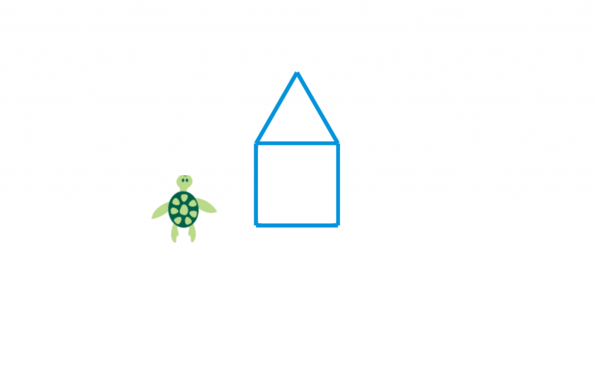

---
## Паянтова къща

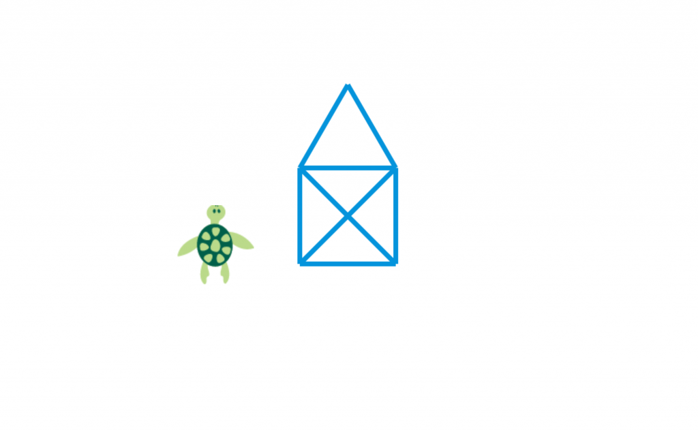

---

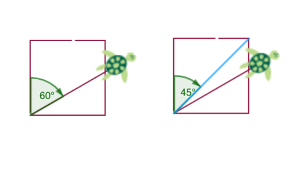

---
## ОСНОВНИ ДУМИ ОТ РЕЧНИКА НА КОСТЕНУРКАТА

---
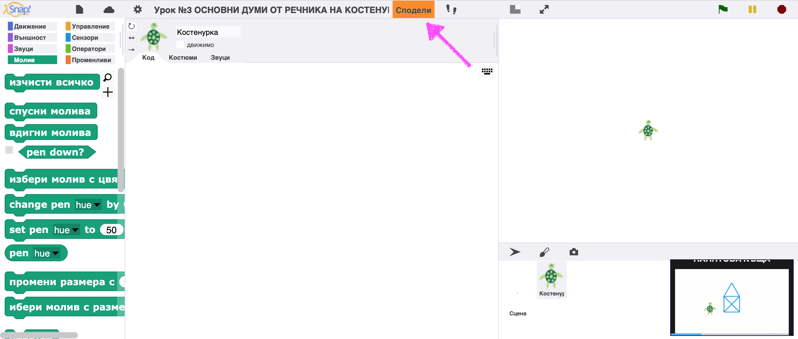

---
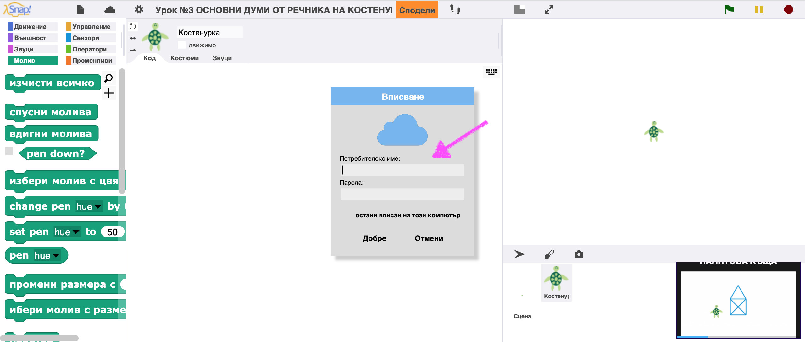

---
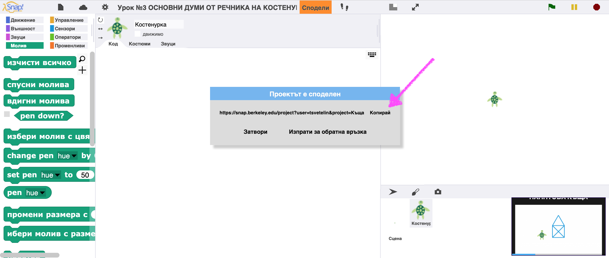

---
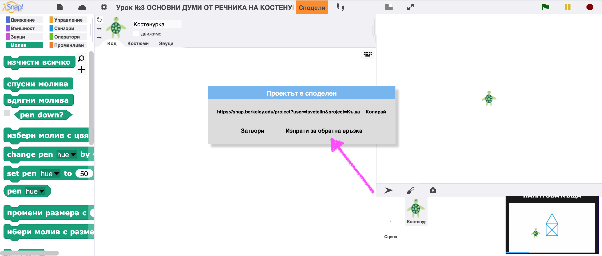

---
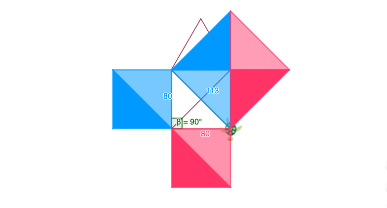

---
<!-- .slide: id="q1" -->
## Задача 1
## Какво ще начертае

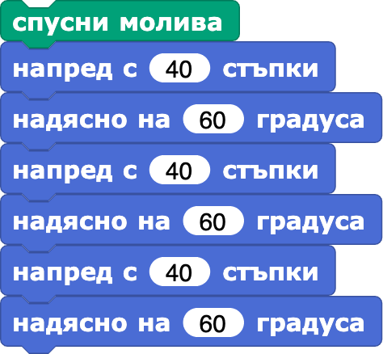

[А) Триъгълник](#/a)

[Б) Шестоъгълник](#/a)

[В) Половин шестоъгълник](#/a)

[Г) Начупена линия](#/a)

[Д) Друга фигура](#/a)

v---v
<!-- .slide: id="a" -->
Натиснете стрелката вдясно на екрана и проверете сами

---
## Задача 2

Като използвате само блоковете  и  нарисувайте:

* Цвете
* Името си

---
## Лого
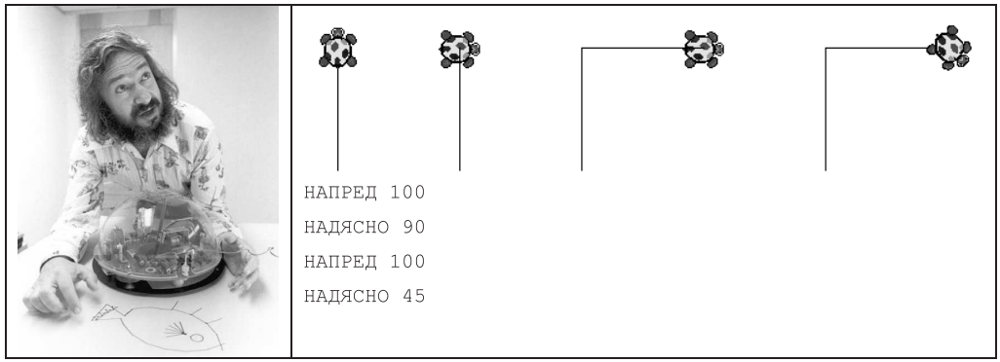

---
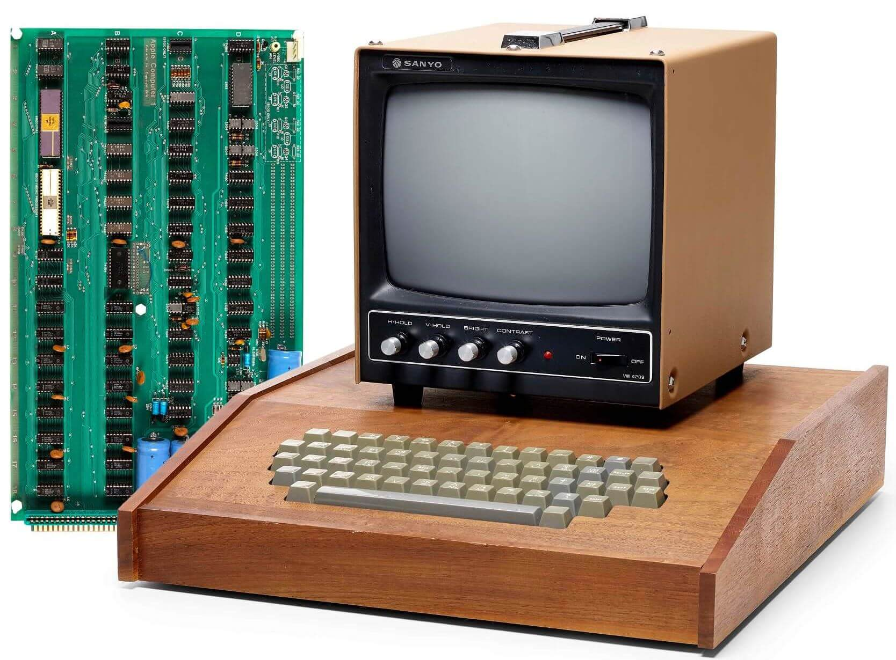

---
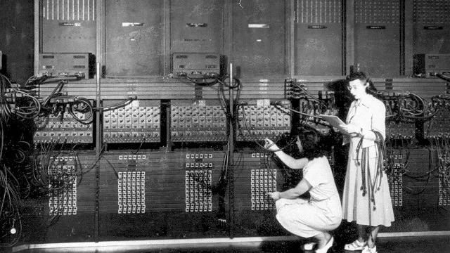

---
# От участниците

---
# НЯМА :(

---
## Сподетеле вашите програми

---
# Обобщение

---
# Благодаря

---
## Бележки

##### Урокът е базиран на учебника ‘Информатика за начинаещи – част 1 – или с костенурката напред’, Евгения Сендова, Румен Николов, Издателство “Народна просвета”, 1989 г.

