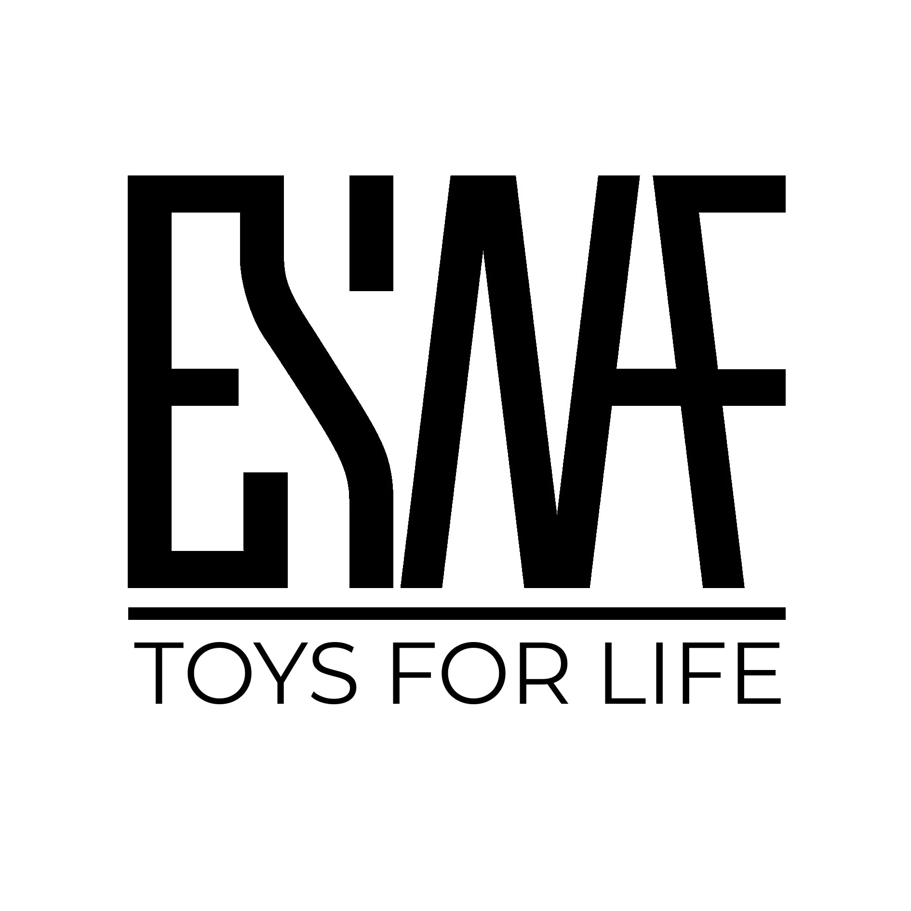
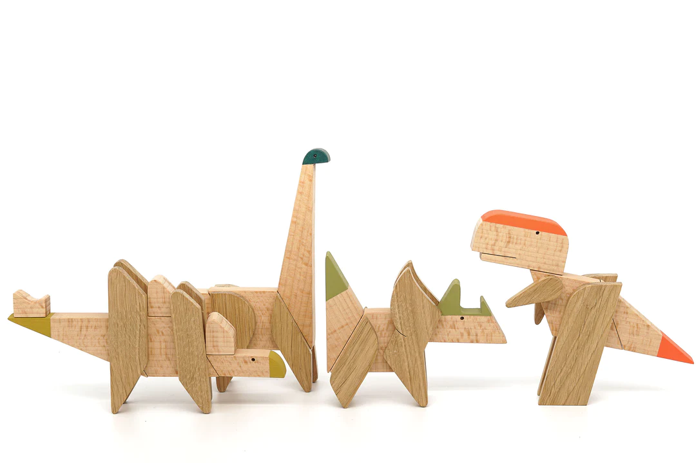
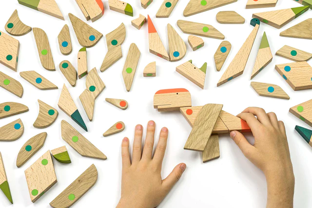
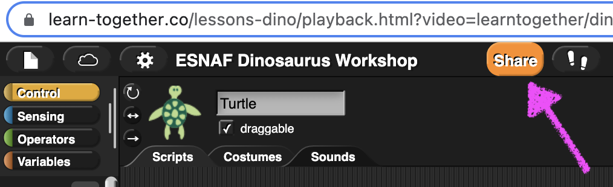
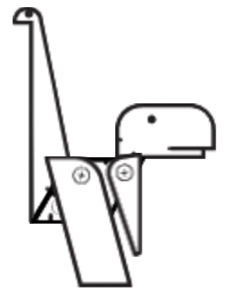
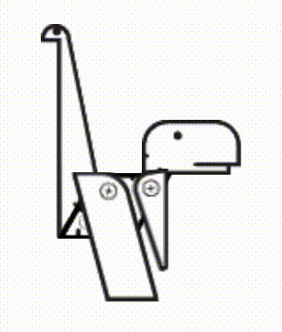
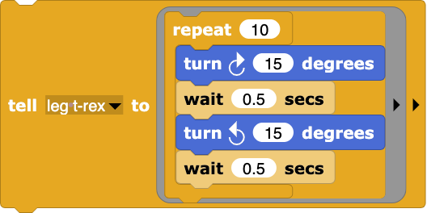

# Добре дошли

---
## Изследователи с компютър

---
## Цел на демонстрацията

* Да сглобим динозавър на екрана
* Да го раздвижим в анимация

---
## Game of Dinosaurs collection

---

---
# Да сглобим динозавър

---
# Анимация

---
# Вие сте на ход!

---
# От участниците

Няма :(

---
## Изпратете вашите модели и анимации 

* Натиснете бутона Сподели. 
* После Изпрати за обратна връзка.
 

---
# Обобщение

---
# Обобщение

---
# Обобщение

---
# Благодаря
