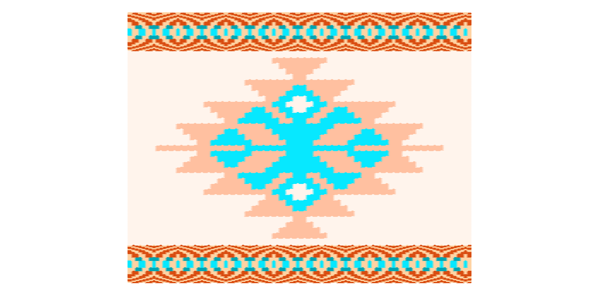

# Добре дошли

---
## Изследователи с компютър

 Цветелин Андреев

---
## Цел на урока

* Да създадем собствени модели на черги.
* Да експериментираме със схеми на тъкане.

---
# Основни команди

---
# От участниците

---
# НЯМА :(

---
## Изпратете вашите модели 

* Натиснете бутона Сподели. После натиснете Изпрати за обратна връзка.

---
# Благодаря
