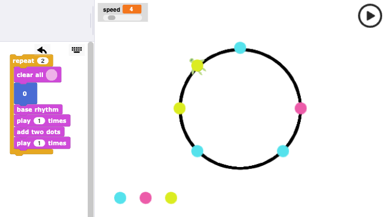
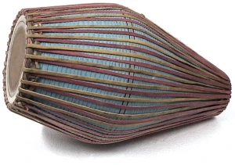
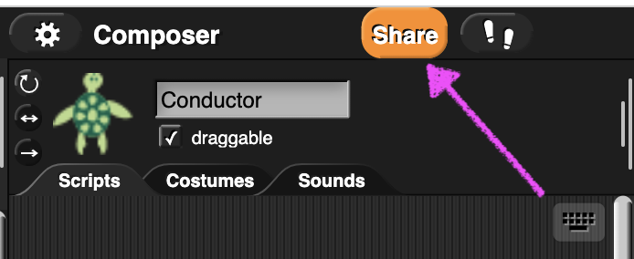

# Добре дошли

---
## Изследователи с компютър

 Цветелин Андреев

---
## Преговор

---
## Цел

Да направим ритъм, в който се чуват звуци едновременно

---
# Mrdanga ...

---
# Демонстрация.

---
# Вие сте на ход!

---
## Изпратете вашите композиции 

* Натиснете бутона Сподели. 
* После Изпрати за обратна връзка.

---
# Благодаря
